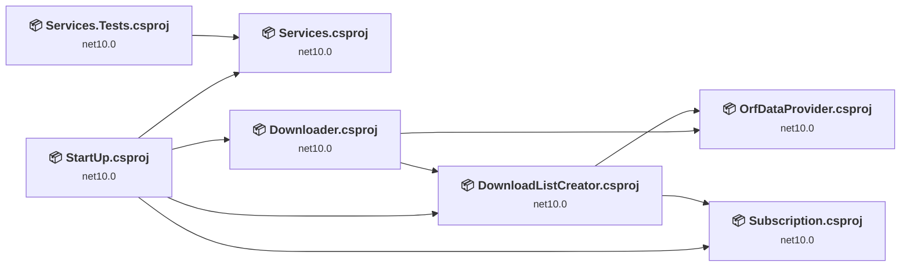
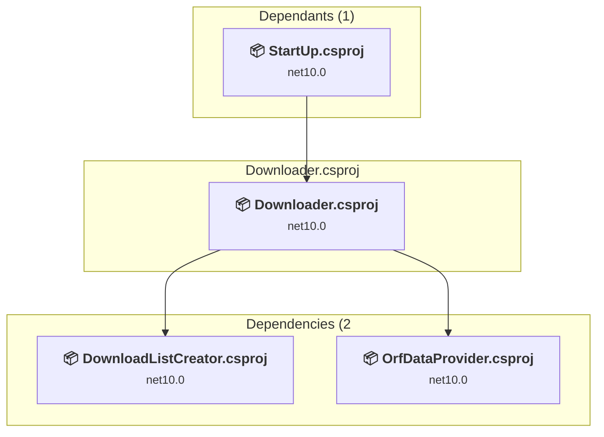
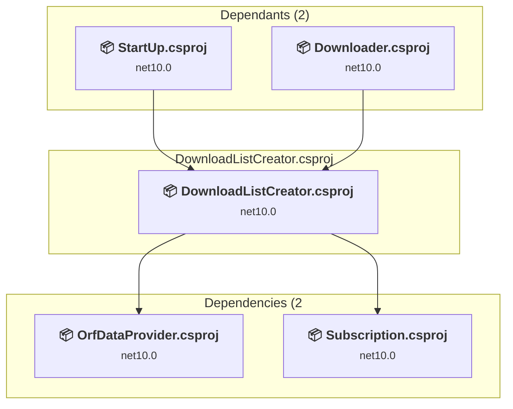
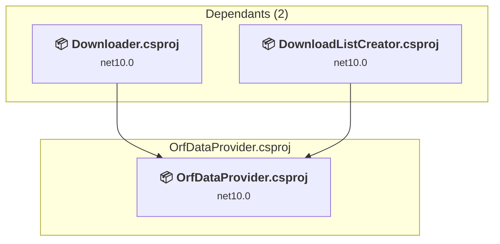
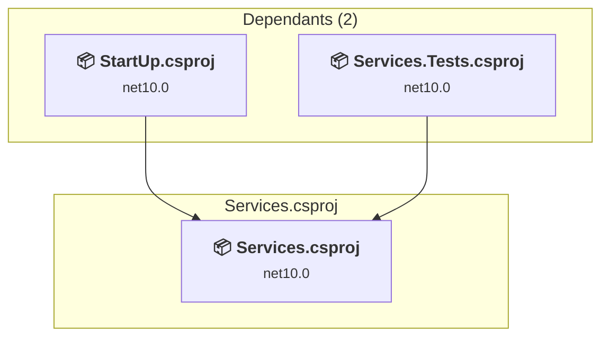
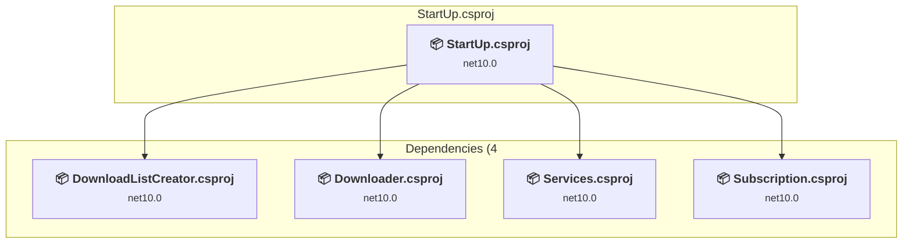
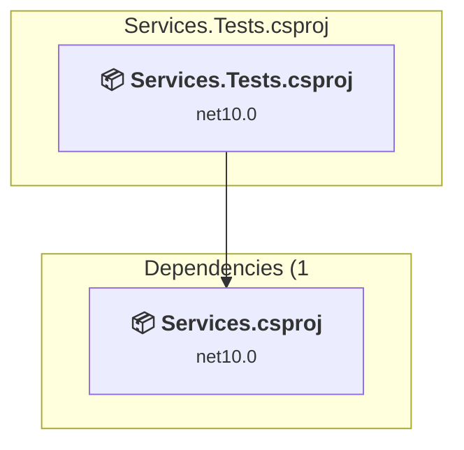

# Projects and dependencies analysis

This document provides a comprehensive overview of the projects and their dependencies in the context of upgrading to .NETCoreApp,Version=v10.0.

## Table of Contents

- [Executive Summary](#executive-Summary)
  - [Highlevel Metrics](#highlevel-metrics)
  - [Projects Compatibility](#projects-compatibility)
  - [Package Compatibility](#package-compatibility)
  - [API Compatibility](#api-compatibility)
  - [Binding Redirect Configuration](#binding-redirect-configuration)
- [Aggregate NuGet packages details](#aggregate-nuget-packages-details)
- [Top API Migration Challenges](#top-api-migration-challenges)
  - [Technologies and Features](#technologies-and-features)
  - [Most Frequent API Issues](#most-frequent-api-issues)
- [Projects Relationship Graph](#projects-relationship-graph)
- [Project Details](#project-details)

  - [src\Downloader\Downloader.csproj](#srcdownloaderdownloadercsproj)
  - [src\DownloadListCreator\DownloadListCreator.csproj](#srcdownloadlistcreatordownloadlistcreatorcsproj)
  - [src\OrfDataProvider\OrfDataProvider.csproj](#srcorfdataproviderorfdataprovidercsproj)
  - [src\Services\Services.csproj](#srcservicesservicescsproj)
  - [src\StartUp\StartUp.csproj](#srcstartupstartupcsproj)
  - [src\Subscription\Subscription.csproj](#srcsubscriptionsubscriptioncsproj)
  - [src\tests\Services.Tests\Services.Tests.csproj](#srctestsservicestestsservicestestscsproj)

## Executive Summary

### Highlevel Metrics

| Metric | Count | Status |
| :--- | :---: | :--- |
| Total Projects | 7 | 0 require upgrade |
| Total NuGet Packages | 17 | All compatible |
| Total Code Files | 82 |  |
| Total Code Files with Incidents | 0 |  |
| Total Lines of Code | 3534 |  |
| Total Number of Issues | 0 |  |
| Estimated LOC to modify | 0+ | at least 0,0% of codebase |

### Projects Compatibility

| Project | Target Framework | Difficulty | Package Issues | API Issues | Binding Issues | Est. LOC Impact | Description |
| :--- | :---: | :---: | :---: | :---: | :---: | :---: | :--- |
| [src\Downloader\Downloader.csproj](#srcdownloaderdownloadercsproj) | net10.0 | ✅ None | 0 | 0 | 0 |  | ClassLibrary, Sdk Style = True |
| [src\DownloadListCreator\DownloadListCreator.csproj](#srcdownloadlistcreatordownloadlistcreatorcsproj) | net10.0 | ✅ None | 0 | 0 | 0 |  | ClassLibrary, Sdk Style = True |
| [src\OrfDataProvider\OrfDataProvider.csproj](#srcorfdataproviderorfdataprovidercsproj) | net10.0 | ✅ None | 0 | 0 | 0 |  | ClassLibrary, Sdk Style = True |
| [src\Services\Services.csproj](#srcservicesservicescsproj) | net10.0 | ✅ None | 0 | 0 | 0 |  | ClassLibrary, Sdk Style = True |
| [src\StartUp\StartUp.csproj](#srcstartupstartupcsproj) | net10.0 | ✅ None | 0 | 0 | 0 |  | DotNetCoreApp, Sdk Style = True |
| [src\Subscription\Subscription.csproj](#srcsubscriptionsubscriptioncsproj) | net10.0 | ✅ None | 0 | 0 | 0 |  | ClassLibrary, Sdk Style = True |
| [src\tests\Services.Tests\Services.Tests.csproj](#srctestsservicestestsservicestestscsproj) | net10.0 | ✅ None | 0 | 0 | 0 |  | DotNetCoreApp, Sdk Style = True |

### Package Compatibility

| Status | Count | Percentage |
| :--- | :---: | :---: |
| ✅ Compatible | 17 | 100,0% |
| ⚠️ Incompatible | 0 | 0,0% |
| 🔄 Upgrade Recommended | 0 | 0,0% |
| ***Total NuGet Packages*** | ***17*** | ***100%*** |

### API Compatibility

| Category | Count | Impact |
| :--- | :---: | :--- |
| 🔴 Binary Incompatible | 0 | High - Require code changes |
| 🟡 Source Incompatible | 0 | Medium - Needs re-compilation and potential conflicting API error fixing |
| 🔵 Behavioral change | 0 | Low - Behavioral changes that may require testing at runtime |
| ✅ Compatible | 0 |  |
| ***Total APIs Analyzed*** | ***0*** |  |

## Aggregate NuGet packages details

| Package | Current Version | Suggested Version | Projects | Description |
| :--- | :---: | :---: | :--- | :--- |
| coverlet.collector | 10.0.1 |  | [Services.Tests.csproj](#srctestsservicestestsservicestestscsproj) | ✅Compatible |
| HtmlAgilityPack | 1.13.0 |  | [Services.csproj](#srcservicesservicescsproj) [Services.Tests.csproj](#srctestsservicestestsservicestestscsproj) | ✅Compatible |
| Microsoft.Extensions.Configuration | 9.0.0-preview.5.24306.7 |  | [StartUp.csproj](#srcstartupstartupcsproj) | ✅Compatible |
| Microsoft.Extensions.Configuration.Abstractions | 9.0.0-preview.5.24306.7 |  | [StartUp.csproj](#srcstartupstartupcsproj) | ✅Compatible |
| Microsoft.Extensions.Configuration.Binder | 9.0.0-preview.5.24306.7 |  | [StartUp.csproj](#srcstartupstartupcsproj) | ✅Compatible |
| Microsoft.Extensions.Configuration.Json | 9.0.0-preview.5.24306.7 |  | [StartUp.csproj](#srcstartupstartupcsproj) | ✅Compatible |
| Microsoft.Extensions.DependencyInjection | 9.0.0-preview.5.24306.7 |  | [StartUp.csproj](#srcstartupstartupcsproj) | ✅Compatible |
| Microsoft.Extensions.DependencyInjection.Abstractions | 10.0.12 |  | [Services.csproj](#srcservicesservicescsproj) [StartUp.csproj](#srcstartupstartupcsproj) [Subscription.csproj](#srcsubscriptionsubscriptioncsproj) | ✅Compatible |
| Microsoft.Extensions.Hosting.Abstractions | 8.0.0 |  | [StartUp.csproj](#srcstartupstartupcsproj) | ✅Compatible |
| Microsoft.Extensions.Options | 10.0.12 |  | [Downloader.csproj](#srcdownloaderdownloadercsproj) [DownloadListCreator.csproj](#srcdownloadlistcreatordownloadlistcreatorcsproj) [Subscription.csproj](#srcsubscriptionsubscriptioncsproj) | ✅Compatible |
| Microsoft.Extensions.Options.ConfigurationExtensions | 8.0.0 |  | [StartUp.csproj](#srcstartupstartupcsproj) | ✅Compatible |
| Microsoft.NET.Test.Sdk | 18.10.0 |  | [Services.Tests.csproj](#srctestsservicestestsservicestestscsproj) | ✅Compatible |
| System.CommandLine | 2.0.0-beta4.22272.1 |  | [StartUp.csproj](#srcstartupstartupcsproj) | ✅Compatible |
| System.CommandLine.NamingConventionBinder | 2.0.0-beta4.22272.1 |  | [StartUp.csproj](#srcstartupstartupcsproj) | ✅Compatible |
| System.IO.Abstractions | 22.2.0 |  | [Downloader.csproj](#srcdownloaderdownloadercsproj) [DownloadListCreator.csproj](#srcdownloadlistcreatordownloadlistcreatorcsproj) [Subscription.csproj](#srcsubscriptionsubscriptioncsproj) | ✅Compatible |
| xunit | 2.9.3 |  | [Services.Tests.csproj](#srctestsservicestestsservicestestscsproj) | ✅Compatible |
| xunit.runner.visualstudio | 4.0.0 |  | [Services.Tests.csproj](#srctestsservicestestsservicestestscsproj) | ✅Compatible |

## Top API Migration Challenges

### Technologies and Features

| Technology | Issues | Percentage | Migration Path |
| :--- | :---: | :---: | :--- |

### Most Frequent API Issues

| API | Count | Percentage | Category |
| :--- | :---: | :---: | :--- |

## Projects Relationship Graph

Legend:
📦 SDK-style project
⚙️ Classic project

## Project Details

### src\Downloader\Downloader.csproj

#### Project Info

- **Current Target Framework:** net10.0✅
- **SDK-style**: True
- **Project Kind:** ClassLibrary
- **Dependencies**: 2
- **Dependants**: 1
- **Number of Files**: 5
- **Lines of Code**: 361
- **Estimated LOC to modify**: 0+ (at least 0,0% of the project)

#### Dependency Graph

Legend:
📦 SDK-style project
⚙️ Classic project

### API Compatibility

| Category | Count | Impact |
| :--- | :---: | :--- |
| 🔴 Binary Incompatible | 0 | High - Require code changes |
| 🟡 Source Incompatible | 0 | Medium - Needs re-compilation and potential conflicting API error fixing |
| 🔵 Behavioral change | 0 | Low - Behavioral changes that may require testing at runtime |
| ✅ Compatible | 0 |  |
| ***Total APIs Analyzed*** | ***0*** |  |

### src\DownloadListCreator\DownloadListCreator.csproj

#### Project Info

- **Current Target Framework:** net10.0✅
- **SDK-style**: True
- **Project Kind:** ClassLibrary
- **Dependencies**: 2
- **Dependants**: 2
- **Number of Files**: 6
- **Lines of Code**: 271
- **Estimated LOC to modify**: 0+ (at least 0,0% of the project)

#### Dependency Graph

Legend:
📦 SDK-style project
⚙️ Classic project

### API Compatibility

| Category | Count | Impact |
| :--- | :---: | :--- |
| 🔴 Binary Incompatible | 0 | High - Require code changes |
| 🟡 Source Incompatible | 0 | Medium - Needs re-compilation and potential conflicting API error fixing |
| 🔵 Behavioral change | 0 | Low - Behavioral changes that may require testing at runtime |
| ✅ Compatible | 0 |  |
| ***Total APIs Analyzed*** | ***0*** |  |

### src\OrfDataProvider\OrfDataProvider.csproj

#### Project Info

- **Current Target Framework:** net10.0✅
- **SDK-style**: True
- **Project Kind:** ClassLibrary
- **Dependencies**: 0
- **Dependants**: 2
- **Number of Files**: 9
- **Lines of Code**: 526
- **Estimated LOC to modify**: 0+ (at least 0,0% of the project)

#### Dependency Graph

Legend:
📦 SDK-style project
⚙️ Classic project

### API Compatibility

| Category | Count | Impact |
| :--- | :---: | :--- |
| 🔴 Binary Incompatible | 0 | High - Require code changes |
| 🟡 Source Incompatible | 0 | Medium - Needs re-compilation and potential conflicting API error fixing |
| 🔵 Behavioral change | 0 | Low - Behavioral changes that may require testing at runtime |
| ✅ Compatible | 0 |  |
| ***Total APIs Analyzed*** | ***0*** |  |

### src\Services\Services.csproj

#### Project Info

- **Current Target Framework:** net10.0✅
- **SDK-style**: True
- **Project Kind:** ClassLibrary
- **Dependencies**: 0
- **Dependants**: 2
- **Number of Files**: 32
- **Lines of Code**: 753
- **Estimated LOC to modify**: 0+ (at least 0,0% of the project)

#### Dependency Graph

Legend:
📦 SDK-style project
⚙️ Classic project

### API Compatibility

| Category | Count | Impact |
| :--- | :---: | :--- |
| 🔴 Binary Incompatible | 0 | High - Require code changes |
| 🟡 Source Incompatible | 0 | Medium - Needs re-compilation and potential conflicting API error fixing |
| 🔵 Behavioral change | 0 | Low - Behavioral changes that may require testing at runtime |
| ✅ Compatible | 0 |  |
| ***Total APIs Analyzed*** | ***0*** |  |

### src\StartUp\StartUp.csproj

#### Project Info

- **Current Target Framework:** net10.0✅
- **SDK-style**: True
- **Project Kind:** DotNetCoreApp
- **Dependencies**: 4
- **Dependants**: 0
- **Number of Files**: 15
- **Lines of Code**: 1150
- **Estimated LOC to modify**: 0+ (at least 0,0% of the project)

#### Dependency Graph

Legend:
📦 SDK-style project
⚙️ Classic project

### API Compatibility

| Category | Count | Impact |
| :--- | :---: | :--- |
| 🔴 Binary Incompatible | 0 | High - Require code changes |
| 🟡 Source Incompatible | 0 | Medium - Needs re-compilation and potential conflicting API error fixing |
| 🔵 Behavioral change | 0 | Low - Behavioral changes that may require testing at runtime |
| ✅ Compatible | 0 |  |
| ***Total APIs Analyzed*** | ***0*** |  |

### src\Subscription\Subscription.csproj

#### Project Info

- **Current Target Framework:** net10.0✅
- **SDK-style**: True
- **Project Kind:** ClassLibrary
- **Dependencies**: 0
- **Dependants**: 2
- **Number of Files**: 9
- **Lines of Code**: 223
- **Estimated LOC to modify**: 0+ (at least 0,0% of the project)

#### Dependency Graph

Legend:
📦 SDK-style project
⚙️ Classic project

### API Compatibility

| Category | Count | Impact |
| :--- | :---: | :--- |
| 🔴 Binary Incompatible | 0 | High - Require code changes |
| 🟡 Source Incompatible | 0 | Medium - Needs re-compilation and potential conflicting API error fixing |
| 🔵 Behavioral change | 0 | Low - Behavioral changes that may require testing at runtime |
| ✅ Compatible | 0 |  |
| ***Total APIs Analyzed*** | ***0*** |  |

### src\tests\Services.Tests\Services.Tests.csproj

#### Project Info

- **Current Target Framework:** net10.0✅
- **SDK-style**: True
- **Project Kind:** DotNetCoreApp
- **Dependencies**: 1
- **Dependants**: 0
- **Number of Files**: 9
- **Lines of Code**: 250
- **Estimated LOC to modify**: 0+ (at least 0,0% of the project)

#### Dependency Graph

Legend:
📦 SDK-style project
⚙️ Classic project

### API Compatibility

| Category | Count | Impact |
| :--- | :---: | :--- |
| 🔴 Binary Incompatible | 0 | High - Require code changes |
| 🟡 Source Incompatible | 0 | Medium - Needs re-compilation and potential conflicting API error fixing |
| 🔵 Behavioral change | 0 | Low - Behavioral changes that may require testing at runtime |
| ✅ Compatible | 0 |  |
| ***Total APIs Analyzed*** | ***0*** |  |

